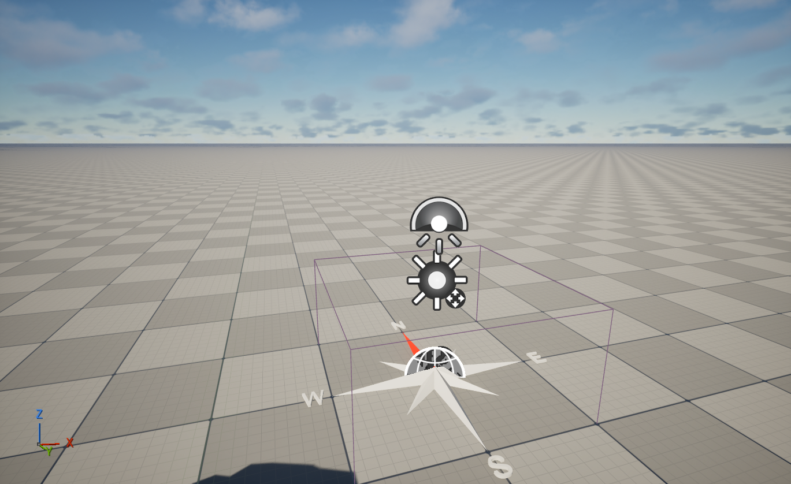
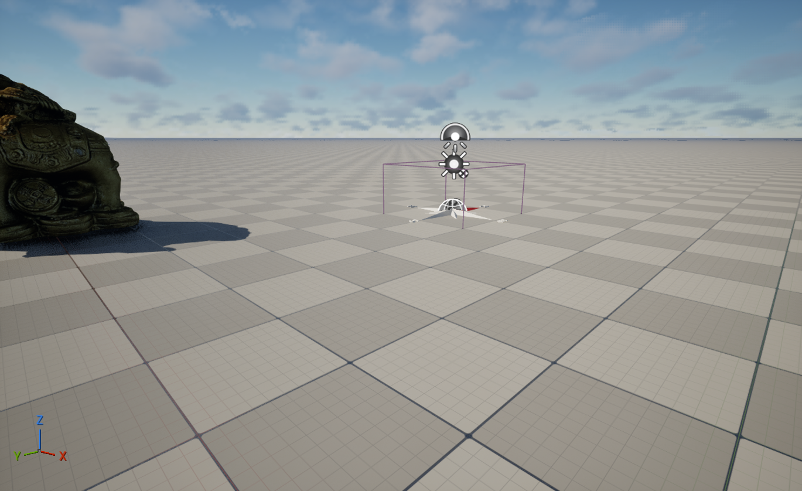
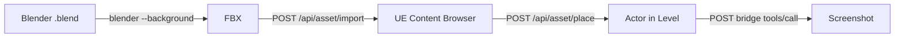

# Sim 5.7 — Unreal Engine + AI Plugin Bridge

A **Unreal Engine 5.7** project with a custom HTTP plugin (**UETerminalBridge**) that exposes UE editor functionality via REST API — allowing AI assistants (like Gemini/opencode) to import assets, spawn actors, and control the editor programmatically.

Built as a practical test: importing a **textured elephant statue** from Blender `.blend` → FBX → UE5 → placed in level, all via API calls.

---

## Features

| Endpoint | Method | Description |
|---|---|---|
| `/api/status` | GET | Server status check |
| `/api/actors` | GET | List all actors in the current level |
| `/api/spawn` | POST | Spawn an actor by class name |
| `/api/property` | GET | Read an actor's property |
| `/api/property` | POST | Set an actor's property |
| `/api/exec` | POST | Send code/command to editor (extensible) |
| `/api/asset/import` | POST | Import a 3D file (FBX, OBJ, GLTF, etc.) into content browser |
| `/api/asset/place` | POST | Place a content-browser asset as an actor in the level |
| `/api/asset/export` | POST | Export an asset to a file |
| `/api/assets` | GET | List assets in a content folder |

Also integrates **SoftUEBridge** (port 8080) providing 114+ tools: capture-screenshot, set-viewport-camera, run-python-script, exec-console-command, and much more.

---

## Quick Start

### 1. Open the project

Launch `sim.uproject` with UE 5.7. The plugin auto-loads.

### 2. Check the API is running

```bash
curl http://127.0.0.1:8090/api/status
# → {"status":"running","plugin":"UETerminalBridge","editor":true}
```

### 3. Import a 3D model

```bash
curl -X POST http://127.0.0.1:8090/api/asset/import \
  -H "Content-Type: application/json" \
  -d '{"file":"C:/path/to/model.fbx","destination":"/Game/MyFolder"}'
```

### 4. Place it in the level

```bash
curl -X POST http://127.0.0.1:8090/api/asset/place \
  -H "Content-Type: application/json" \
  -d '{"asset":"/Game/MyFolder/model.model","label":"MyModel","location":[0,300,0]}'
```

### 5. List all actors

```bash
curl http://127.0.0.1:8090/api/actors
```

### 6. Read/Write a property

```bash
# Read
curl "http://127.0.0.1:8090/api/property?actor=MyModel&property=RelativeLocation"

# Write
curl -X POST http://127.0.0.1:8090/api/property \
  -H "Content-Type: application/json" \
  -d '{"actor":"MyModel","property":"bHidden","value":"true"}'
```

### 7. Viewport screenshot (via SoftUEBridge)

```bash
curl -X POST http://127.0.0.1:8080/bridge \
  -H "Content-Type: application/json" \
  -d '{"jsonrpc":"2.0","id":1,"method":"tools/call","params":{"name":"capture-screenshot","arguments":{"Filename":"screenshot.png"}}}'
```

---

## Demo: Elephant Statue Import

This project includes a complete import pipeline demonstrating the full workflow:

1. **Blender CLI export** — `.blend` → FBX with embedded textures via Blender 5.1 headless
2. **REST API import** — FBX imported to `/Game/Imports/ElephantStatue/Textured/`
3. **Level placement** — `POST /api/asset/place` spawns `StaticMeshActor` at `(0, 600, 0)`
4. **Screenshot** — via SoftUEBridge `capture-screenshot`

| Untextured | Textured |
|---|---|
|  |  |
| Raw mesh import (no textures) | FBX with embedded textures |

**Imported assets:**
| Asset | Type | Path |
|---|---|---|
| `elephant_embedded` | StaticMesh | `/Game/Imports/ElephantStatue/Textured/` |
| `3DModel_LowPoly_001` | Material (MIC) | `/Game/Imports/ElephantStatue/Textured/` |
| `3DModel_LowPoly` | Texture2D (Diffuse) | `/Game/Imports/ElephantStatue/Textured/` |
| `1_normal` | Texture2D (Normal) | `/Game/Imports/ElephantStatue/Textured/` |
| `1_metallic` | Texture2D (RMA) | `/Game/Imports/ElephantStatue/Textured/` |

---

## Pipeline: .blend → UE5 via API



---

## Plugin Architecture

```
Plugins/
├── UETerminalBridge/          ← Custom C++ plugin (our code)
│   └── Source/
│       └── UETerminalBridge/
│           ├── Public/
│           │   ├── TerminalServer.h
│           │   └── UETerminalBridgeModule.h
│           ├── Private/
│           │   ├── TerminalServer.cpp
│           │   └── UETerminalBridgeModule.cpp
│           └── UETerminalBridge.Build.cs
└── SoftUEBridge/              ← 114-tool open-source bridge (external)
```

**UETerminalBridge** (Port 8090):
- Lightweight C++ HTTP server using UE's built-in `HTTPServer` module
- Routes: status, actors, spawn, property, asset import/export/place
- No external dependencies — pure UE5

**SoftUEBridge** (Port 8080):
- 114 tools for UE editor automation
- Screenshot, camera control, Python execution, asset queries, more
- External open-source project (see Credits)

---

## Requirements

- **Unreal Engine 5.7**
- Visual Studio 2022 (for C++ builds)
- Optional: Blender 5.1+ (for `.blend` → FBX conversion)

---

## Development

### Building the plugin

```bash
# From command line:
UnrealBuildTool.exe simEditor Win64 Development \
  -Project="path/to/sim.uproject" -SkipIniMerge
```

### Adding new endpoints

Edit `TerminalServer.cpp` and add a new `AddRoute(...)` call in the `Start()` method. The format:

```cpp
AddRoute(Router, RouteHandles, TEXT("/api/my-command"), EHttpServerRequestVerbs::VERB_POST,
    [](const FHttpServerRequest& Request) -> TUniquePtr<FHttpServerResponse>
    {
        TSharedPtr<FJsonObject> Json = ParseBody(Request);
        // ... handle request ...
        return JsonResponse(Result);
    });
```

---

## Credits

| Tool | Purpose |
|---|---|
| **[Unreal Engine 5.7](https://www.unrealengine.com/)** | Game engine & editor |
| **[SoftUEBridge](https://github.com/anomalyco/soft-ue-bridge)** | 114-tool UE editor automation bridge |
| **[opencode](https://opencode.ai)** | AI coding assistant (this project was built interactively with opencode) |
| **[Gemini](https://deepmind.google/technologies/gemini/)** | LLM powering the AI-assisted development workflow |
| **[Blender 5.1](https://www.blender.org/)** | 3D model FBX export pipeline |
| **[Sketchfab](https://sketchfab.com/)** | Elephant statue 3D model source |

---

## License

**Code is open source** — All C++ plugin code (`Plugins/UETerminalBridge/`), build scripts, and documentation in this repository are provided under the MIT License. You are free to use, modify, and distribute them.

**Assets are NOT included** — The `.blend`, `.fbx`, textures, and all other 3D assets (`Imports/`, `Content/Imports/`, `Content/FabAssets/`) are **not** part of this open-source release. They are either:
- Third-party assets from Sketchfab / Fab / Quixel (retain their original licenses)
- Demo assets created for testing only

FabAssets (`Content/FabAssets/`) are excluded from version control entirely via `.gitignore`.

**Third-party plugins:**
- **SoftUEBridge** — separate open-source project, see https://github.com/anomalyco/soft-ue-bridge
- **Unreal Engine 5.7** — proprietary, subject to Epic Games' EULA
